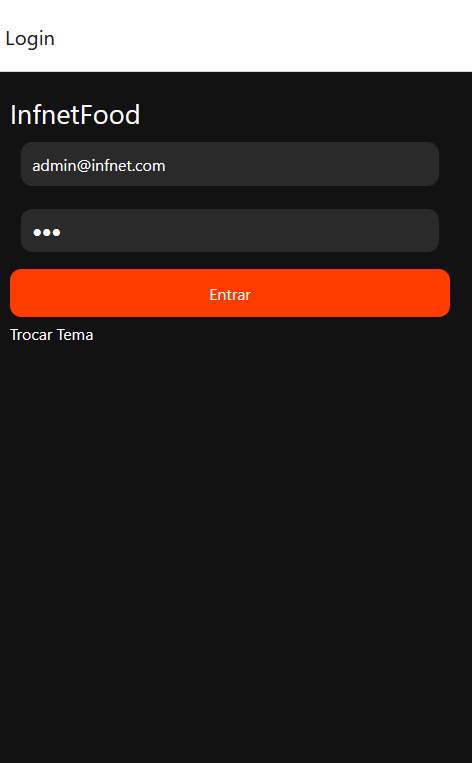
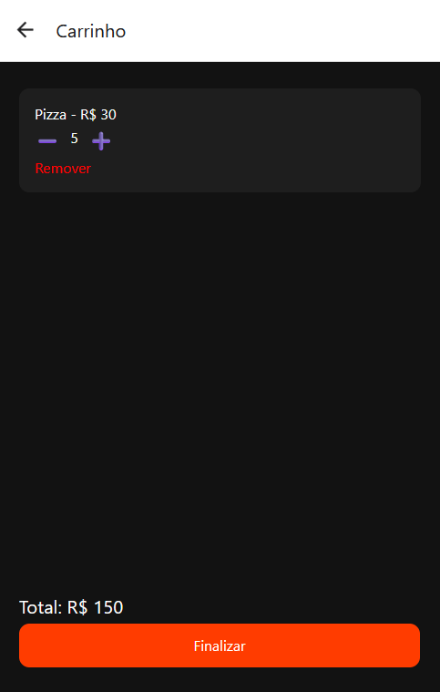
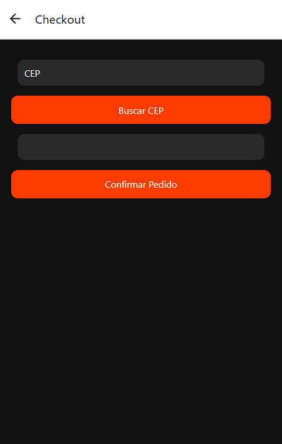

# InfnetFood

Aplicativo de delivery desenvolvido com React Native + Expo.

##Funcionalidades

- Login mockado
- Listagem de produtos
- Carrinho funcional
- Controle de quantidade
- Remoção de itens
- Checkout com API ViaCEP
- Tema claro/escuro

  -use: admin@infnet.com
-senha: 123

-
-Apos ir aos produtos, e escolher qual voce quer 
e a quantidade eles ficarao salvos no carrinho.
-
Click em Finalizar!

-
-Agora voce esta aonde voce deve colocar o seu CEP 
-
Click em confirmar pedido!

-
-Voce podera ver seu pedidos assim!
-

-
